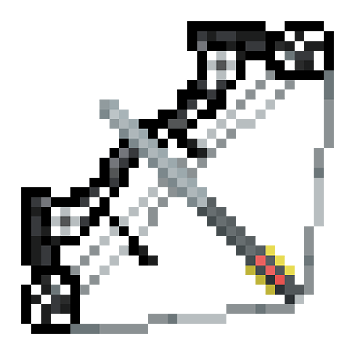

# Compound Bow

## Information and Description

This mod adds a new weapon to the game: the compound bow and arrow.  This powerful weapon is unlike the vanilla bow and arrow; it is accurate, faster, and deadly.

That goes without saying, all credit goes to `agentley` for the idea and fantastic textures to create this mod while I was given the charge to bring it to life.

## Features

This mod includes the following features:

- Compound bow: pulls back twice as fast as a normal bow.  Fires the compound arrow with perfect aim and 25% more speed than a normal bow and arrow.
- Compound arrow: the only arrow the compound bow can fire.  Applies 25% more damage than a normal bow and arrow.
- Other items necessary to craft the bow such as,
    - Compound blueprint
    - Compound wheel
    - Compound limb
    - Compound grip

> [!TIP]
> You can find a list of recipes and ways to obtain the items above to craft the compound bow and arrow [here](./recipes.md).

## Versions

This mod is **Fabric** ONLY.  There is no plan to support Forge.

This mod is available for the following Minecraft versions (click the version to reveal the FAPI version needed):

1.20.1

- Fabric API version: <a href="https://modrinth.com/mod/fabric-api/version/0.92.0+1.20.1" target="_blank"> 0.92.0+1.20.1 </a>

> [!NOTE]
> There mod will be backported to 1.20 and ported to 1.20.2-1.20.4.

> [!NOTE]
> Although links are provided for the Fabric API, they may not be the newest versions.

## Client and Server Support

Client: **Required**

Server: **Required**

## Other Notes  