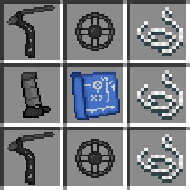
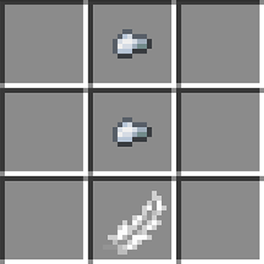
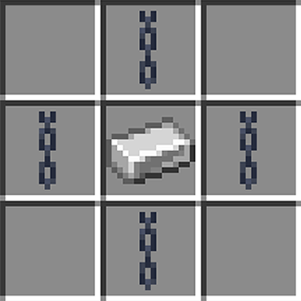
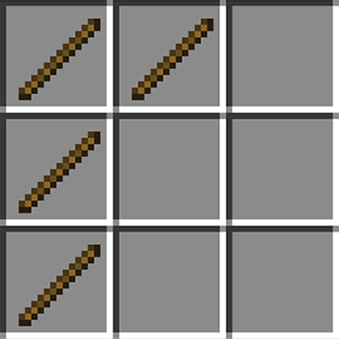
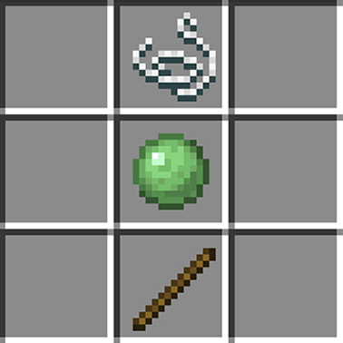

# Compound Bow | Recipes

## Compound Bow

To craft this item, you need one (1) compound blueprint, two (2) compound wheels, two (2) compound limbs, one (1) compound grip, and three (3) string and arrange them into the following pattern:

## Compound Arrow

To craft this item, you need two (2) iron nuggets and one (1) feather and arrange them into the following pattern:

## Compound Blueprint

This item is only obtainable by looting End City chests.

## Compound Wheel

To craft this item, you need four (4) chains and one (1) iron ingot and arrange them into the following pattern: 

## Compound Limb

To craft this item, you need four (4) sticks and arrange them into the following pattern:

## Compound Grip

To craft this item, you need one (1) string, one (1) slime ball, and one (1) stick and arrange them into the following pattern:

