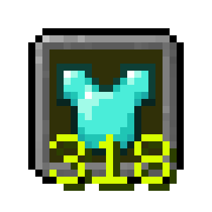

# Armor Indicator

## Information and Description

This client-side mod adds a simple armor indicator onto the screen so you do not have to access your inventory to view your armor durability.

To use this mod, download the mod it and move it to your `.minecraft/mods` folder. Additionally, you will need to install the Fabric API jar for this mod to work.

The settings for this mod can be customized if you install the Cloth Config API mod in addition to this mod (see [#versions](#versions) to find compatible versions). This menu can be opened by pressing `RSHIFT`, or reassigned to your liking through the game's keybind menu. Otherwise, default values will be applied.

## Features

- An armor indicator overlay, configurable with the Cloth Config API.

- An indicator for the current item you are holding, configurable with the Cloth Config API

- With the Cloth Config API, you are provided a number of options to customize this mod to your liking. 

## Versions

This mod is **Fabric** ONLY.  There is no plan to support Forge.

This mod is available for the following Minecraft versions (click the version to reveal the FAPI and Cloth Config API version needed):

1.19.2

  
- Fabric API version: <a href="https://modrinth.com/mod/fabric-api/version/0.77.0+1.19.2" target="_blank"> 0.77.0+1.19.2 </a>

- Cloth Config API version: <a href="https://modrinth.com/mod/cloth-config/version/8.3.115+fabric" target="_blank"> 8.3.115 </a>

1.19.3

  
- Fabric API version: <a href="https://modrinth.com/mod/fabric-api/version/0.76.1+1.19.3" target="_blank"> 0.76.1+1.19.3 </a>

- Cloth Config API version: <a href="https://modrinth.com/mod/cloth-config/version/9.1.104+fabric" target="_blank"> 9.1.104 </a>

1.19.4

  
- Fabric API version: <a href="https://modrinth.com/mod/fabric-api/version/0.87.2+1.19.4" target="_blank"> 0.87.2+1.19.4 </a>

- Cloth Config API version: <a href="https://modrinth.com/mod/cloth-config/version/10.1.117+fabric" target="_blank"> 10.1.117 </a>

1.20

- Fabric API version: <a href="https://modrinth.com/mod/fabric-api/version/0.83.0+1.20" target="_blank"> 0.83.0+1.20 </a>

- Cloth Config API version: <a href="https://modrinth.com/mod/cloth-config/version/11.1.118+fabric" target="_blank"> 11.1.118 </a>

1.20.1

- Fabric API version: <a href="https://modrinth.com/mod/fabric-api/version/0.91.0+1.20.1" target="_blank"> 0.91.0+1.20.1 </a>

- Cloth Config API version: <a href="https://modrinth.com/mod/cloth-config/version/11.1.118+fabric" target="_blank"> 11.1.118 </a>

1.20.2

- Fabric API version: <a href="https://modrinth.com/mod/fabric-api/version/0.91.6+1.20.2" target="_blank"> 0.91.2+1.20.2 </a>

- Cloth Config API version: <a href="https://modrinth.com/mod/cloth-config/version/12.0.119+fabric" target="_blank"> 12.0.119 </a>

1.20.3

- Fabric API version: <a href="https://modrinth.com/mod/fabric-api/version/0.91.1+1.20.3" target="_blank"> 0.91.1+1.20.3 </a>

- Cloth Config API version: <a href="https://modrinth.com/mod/cloth-config/version/13.0.121+fabric" target="_blank"> 13.0.121 </a>

1.20.4

- Fabric API version: <a href="https://modrinth.com/mod/fabric-api/versions?g=1.20.4&c=release" target="_blank"> 0.95.3+1.20.4 </a>

- Cloth Config API version: <a href="https://modrinth.com/mod/cloth-config/version/13.0.121+fabric" target="_blank"> 13.0.121 </a>

> [!NOTE]
> Although links are provided for the Fabric API and Cloth Config API mods, they may not be the newest versions.

## Client and Server Support

Client: **Required**

Server: **Unsupported**