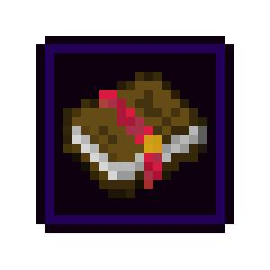

<div id="mod-header">

# Enchantment Tooltips



</div>

## Information and Description

This client-side mod adds a HUD onto your screen for a brief moment (or forever if you want to configure it to do so) to see the list of enchantments that are on an item or book when you select it in your hotbar.

To use this mod, download the mod it and move it to your ```.minecraft/mods``` folder.  Additionally, you will need to install the Fabric API jar for this mod to work.

The settings for this mod can be customized.  This menu can be opened by pressing ```I```, or reassigned to your liking through the game's keybind menu.

## Features

- Very simple: a HUD to see the list of enchantments that are on an item or book when you select it in your hotbar.

This mod has the following configuration options:

- HUD enabled (also assigned to a keybind [`O`]) `(default: true)`
- Change HUD display location `(default: Top Left)`
- Always display the HUD `(default: false)`
- Render the enchanted books onto the screen with the enchantment name `(default: true) `

## Versions

This mod is **Fabric** ONLY.  There is no plan to support Forge.

This mod is available for the following Minecraft versions:

<version>

`1.20` 
`1.20.1`
`1.20.2` 
`1.20.3` 
`1.20.4` 
`1.20.5` 
`1.20.6`

`1.21`
`1.21.1`

</version>

## Client and Server Support

Client: **Required**

Server: **Not Supported**