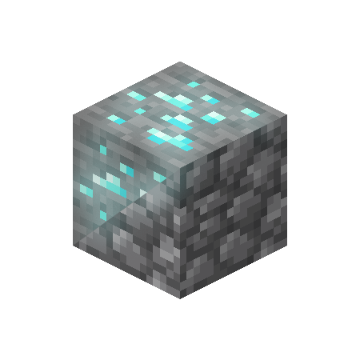

# Ore Extraction | Fabric Mod

## Information and Description

Extract the ore and have it be replaced by it's base block!  This mod is inspired by the [`OreExtraction` plugin made by IceWolf23X](https://modrinth.com/plugin/oreextraction).

## Features

- If there is room in your inventory, the drops from the ore block will be placed directly into your inventory and the ore block will be replaced with its base block, such as cobblestone, cobbled deepslate, netherack, blackstone, or endstone.  Otherwise, the dropped items will fly out.  

  `Note: Silk Touch will drop the block as normal.`

- Mod developers, see [compatibility](#compatibility) to see what you can do to make your ores compatiable with this mod.

## Gamerules

- `doOreExtraction`
	- default: `true`
	- info: when enabled, the ores will be extracted into the player's inventory, or if there is not enough room, will drop from the block.

## Versions

This mod is **Fabric** ONLY.  There is no plan to support Forge.

This mod is available for the following Minecraft versions:

<version>

`1.20`
`1.20.1`
`1.20.2`
`1.20.3`
`1.20.4`
`1.20.5`
`1.20.6`

</version>

## Client and Server Support

Client: **For Singleplayer Only**

Server: **Required**

## Compatibility

The way this mod works is by creating tags for each vanilla block and sorting them into one of these four (4) categories:

- Stone Ores (will be replaced by cobblestone when mined)
- Deepslate Ores (will be replaced by cobbled deepslate when mined)
- Nether Ores (will be replaced by netherrack when mined)
- Blackstone Ores (such as Gilded Blackstone; will be replaced by blackstone when mined)

This mod also adds a fifth tag, End Ores (will be replaced by endstone when mined), for those mods that have end ores.

To add your blocks to these tags, you will need to add them to one of the following tags:

- `ore-extraction:stone_ores`
- `ore-extraction:deepslate_ores`
- `ore-extraction:nether_ores`
- `ore-extraction:blackstone_ores`
- `ore-extraction:end_ores`

If, for example, the ore block is dropped when mined with a normal pickaxe (unlike diamond ore which drops diamonds), then it wouldn't make sense to add it to these tags.