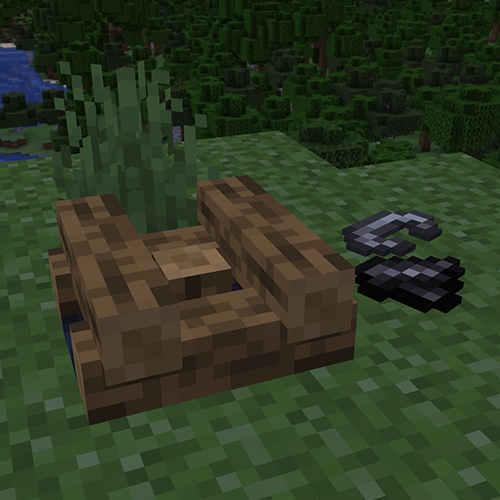

# Realistic Campfires

## Information and Description

Change how the vanilla campfire works by requiring you to put more work in creating and maintaining a campfire.

To use this mod, download the mod it and move it to your `.minecraft/mods` folder. Additionally, you will need to install this mod on your server for it to work properly. The Fabric API jar for this mod is also needed for the client and server.

## Features

Whenever you place down a campfire, it will not be lit. In order to light it on fire, you need to do the following things:

- Drop down any type of log onto the campfire block
- Grab a flint and steel and light the fire

After being lit, the campfire will last for two minutes before being extinguished. Other features include:

- A custom campfire model that indicates a log has been dropped onto the campfire
- `Shift + Right click` to get the log back (note: you need to do so with an empty hand)
- Break the campfire and get the log back
- There are also custom textures for the different logs you drop onto the campfire instead being the default oak log.

These features apply to both the campfire and soul campfire blocks.

## Versions

This mod is **Fabric** ONLY.  There is no plan to support Forge.

This mod is available for the following Minecraft versions (click the version to reveal the FAPI version needed):

1.20

- Fabric API version: <a href="https://modrinth.com/mod/fabric-api/version/0.83.0+1.20" target="_blank"> 0.83.0+1.20 </a>

1.20.1

- Fabric API version: <a href="https://modrinth.com/mod/fabric-api/version/0.91.0+1.20.1" target="_blank"> 0.91.0+1.20.1 </a>

1.20.2

- Fabric API version: <a href="https://modrinth.com/mod/fabric-api/version/0.91.6+1.20.2" target="_blank"> 0.91.2+1.20.2 </a>

1.20.3

- Fabric API version: <a href="https://modrinth.com/mod/fabric-api/version/0.91.1+1.20.3" target="_blank"> 0.91.1+1.20.3 </a>

1.20.4

- Fabric API version: <a href="https://modrinth.com/mod/fabric-api/versions?g=1.20.4&c=release" target="_blank"> 0.95.3+1.20.4 </a>

> [!NOTE]
> Although links are provided for the Fabric API mod, it may not be the newest version.

## Client and Server Support

Client: **Required**

Server: **Required**