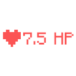

# Simple Health Indicator

## Information and Description

A very simple health indicator. No configs required. Nothing to set up in-game. It's that simple! This client-side mod adds a very simple health indicator so you can see the health of another player.

To use this mod, download the mod it and move it to your .minecraft/mods folder.

I got some requests to add some configurable options to the mod which can be read about [here](./configuration).

## Features

- Very simple: a health indicator shown near the player's name!

## Versions

This mod is **Fabric** ONLY.  There is no plan to support Forge.

This mod is available for the following Minecraft versions:

<version>

`1.20` 
`1.20.1` 
`1.20.2` 
`1.20.3` 
`1.20.4` 
`1.20.5` 
`1.20.6`

`1.21` 
`1.21.1` 

</version>

## Client and Server Support

Client: **Required**

Server: **Unsupported**

## Other Notes  

This mod is known to have issues with certain clients and servers. Most of the time, it is out of my control to fix these issues. This mod has known issues with the following clients and servers:

### Clients

- FeatherMC (only if you use the Top position in the config menu)

### Servers

- PvP Legacy